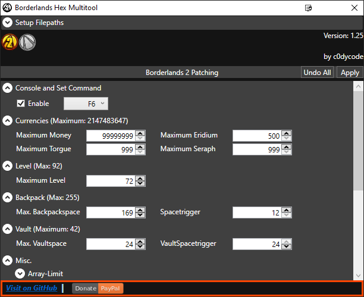

# Preview

# Installation
This new version of the Multitool does not have to be in a specific place.

NOTE: If you have used any standalone tools that are outdated, such as "Backpack-Customizer" or old Multitools (if your tool has the "Backpack Testpatch" you should be fine), you may want to consider
	  either reverting these patches with these tools, or redownload the games exe via steam (only BL2) to avoid possible issues.

# Features
* Enable/Disable Console/Set-Command-Patch
* Customize Console-Key
* Patch Max. Currencies: Money
* * BL2 specific: Eridium, Torgue and Seraph
* * TPS specific: Moonstone
* Maximum Level: ~92
* Backpackspace: ~255
* Vaultspace   : ~42
* Array-Limit-Patch (see FAQ for more info)
* Disable/Enable Sanity Checks
* Adding CustomPatches via. Textfiles

# Usage
First - Once you've opened up the tool, expand "Setup Filepaths" at the top.
Now click on "Select Path" and choose either your "Borderlands2.exe" or "BorderlandsPreSequel.exe", depending on which button you clicked.

Once you've setup the path(s) the icon(s) should no longer be grayscaled.

You can now click on the games icon you want to patch.

Select your desired changes and hit the "Apply" button in the top-right-corner.
That should be everything!

# FAQ:
Q: What is the Spacetrigger?

A: The default is 39. This means, once you buy the last backpack SDU, and therefore reaching 39 backpackslots, that's the point where you'll have the chosen Max Slots instead.
   Meaning - if you choose 24 as a Spacetrigger, you'll get your chosen Max Slots once your purchased SDUs would get you 24 slots. Then 24 will be the point where you'll have your chosen slots at.
   Note: Lowering the Spacetrigger from 39 will most likely increase your Slots --TEMPORARILY-- when purchasing another backpack SDU. So these extra-slots will be gone after reopening the game.

Q: What is the Array-Limit?

A: This is usually not needed. However, people that come across this limit now have an automatic way of patching. 
   Example here: https://github.com/c0dycode/BL2ModStuff/tree/master/Hexediting#removing-the-100-element-limit

Q: Can I patch my game to level higher than 92 aswell?

A: Yes. You can right click on the box where you enter your desired max level to "Unlock" it, up to 255.
   At the time of the release of the v1.12 version these are these known issues:
   - Usually there is no Loot anymore (neither Ammo/Grenades in Boxes, Vendors or anywhere else)
   - Your game will most likely crash when saving/loading the game (if not at 93, it definitely does pretty much everytime beyond 100)
   - The rule of thumb seems to be Max Level + OP levels => less than or equal 100 => No issues.

Q: My Paths are not saving, what should I do?

A: Go to "%localappdata%\BorderlandsHexMultitool" and delete the subfolders, then try again!
   If that also doesn't solve your problem, try running the tool as administrator. Should that also not work, please contact me!

Q: BabyRage ?

A: BabyRage indeed BabyRage

# Changelog:
## v1.17
- Fixed a few details
- Added the option to unlock the max Backpackspace to 100k. Hover your mousecursor over the value-field for more info.
- Added closing of the Filepath-Expander when the mouse leaves it for more than 3 seconds.

## v1.16
- Added Spacecustomization for the Vault/Bank

## v1.15
- Added a small bar at the bottom so YOU can get to this project on GitHub and open up issues or something :P
- Fixed an issue which seems to have been only present on Windows 7
- Added check for the given Filepath. If the provided path doesn't lead to an existing file, the Icon will stay Grayscaled! This is mainly to check filepaths via CLI

## v1.14
- Added CustomPatches (for more information about these, refer to the included CustomPatch Readme.txt)
- Added a little bit of highlighting to the current section the mouse is over
- Increased the size of the Gameicons

## v1.13
- Fixed an issue with reading values when switching from BL2 to TPS and back to BL2 for example.

## v1.12
- Added the option to "unlock" the Max Level-option to let you patch your max level up to 255, in case there ever will be someone planning on fixing the loading/saving crashes/missing loot (drops, ammo, vendors etc)
  when patching beyond 92+OP8. To unlock it, simply right-click it and choose to "Unlock".
  Use at your own risk, I won't fix/attempt to fix these crash issues.

## v1.11
- Fixed an issue with the TPS-Patch to use the console (when the Tool offers you to patch the game if it hasn't yet. Choosing it manually, worked fine)

## v1.10
- Fixed an issue with enable/disable of the weapon sanity check bypass, caused by the changes made in v1.9

## v1.9
- Changed a bit of code, that should improve the speed of reading and writing all the needed data

## v1.8
- Fixed showing the status of the Sanity Check Bypasses and Array-Limit
- Added a small messagebox to inform the user that the tool is doing work

## v1.7
- Fixed the Array-Limit Patch-detection

## v1.6
- Added the option to decide whether or not you want to apply the basic Hexediting (to use UCP for example) during startup.

## v1.5
- Added the Sanity Check Bypass for Items to both games. A quick test kept the weapons in my inventory and game ran fine so far. Please test! :)

## v1.4
- Added Tooltips to "Enable" in "Console and Set Command", "Spacetrigger" in "Backpack" and "Array-Limit"
- Added the possibility to set "Custom" ConsoleKeys. To activate, rightclick the Combobox where "F6" and "Tilde" are listed and check "Custom". 
  The Combobox will turn into a textbox, where you'll type in your own Key. You can still type in F6 or Tilde ofc.
- By adding the "custom" ConsoleKeys, I saw that setting ConsoleKeys was most likely not working for TPS. Sorry about that. It's fixed now :)

## v1.3
- Recompiled this version with .NET Framework 4.5 instead of 4.6.1

## v1.2
- Fixed an issue with trying to Load the Patching-UI when Path(s) have been set up for the first time.
- Added checks for all Patches, so unchanged values are not being patched again
- Added a MessageBox after applying the patch(es) - since you guys love that so much :P
- Added this Readme

# Credits:
- TechnoJackers: Sanity Check Patterns
- Shadowevil1996: Patterns that are needed to patch the console commands and a key-location that made the Levelpatching possible

# Used NuGet Packages/Assemblies:
- Caliburn.Micro
- Costura.Fody
- Extended.Wpf.Toolkit
- Fody
- Ini.Net

# Support
If you enjoy my work and would like to support me, feel free to do so here :)

